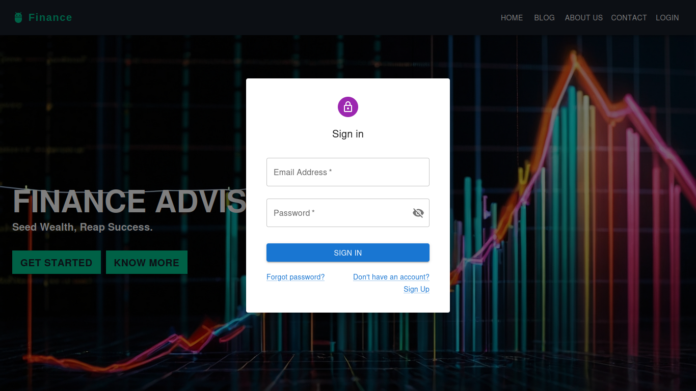
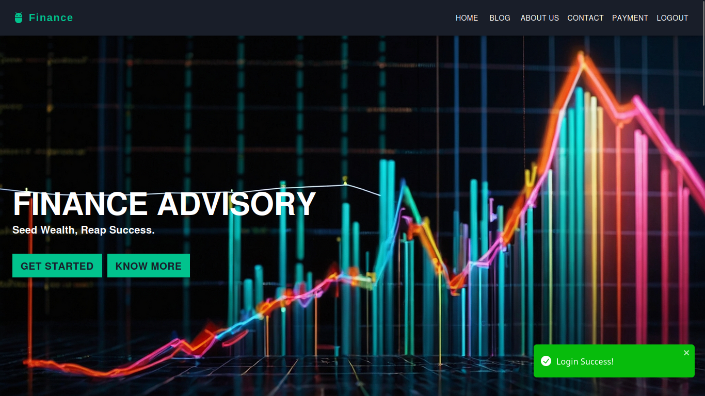
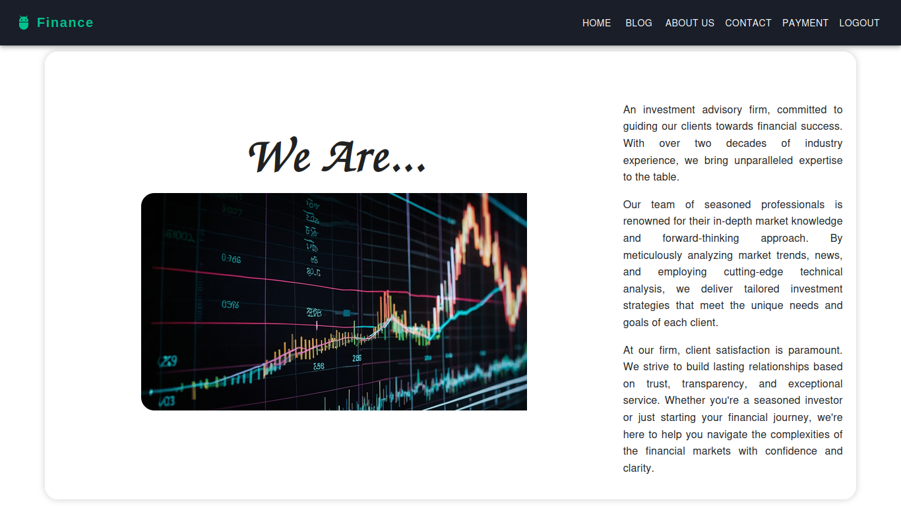
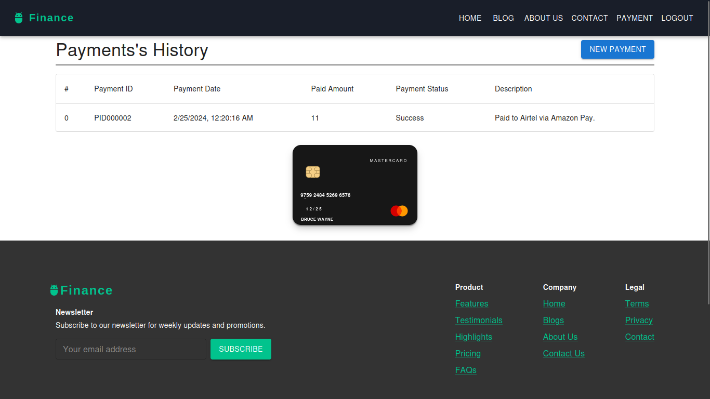
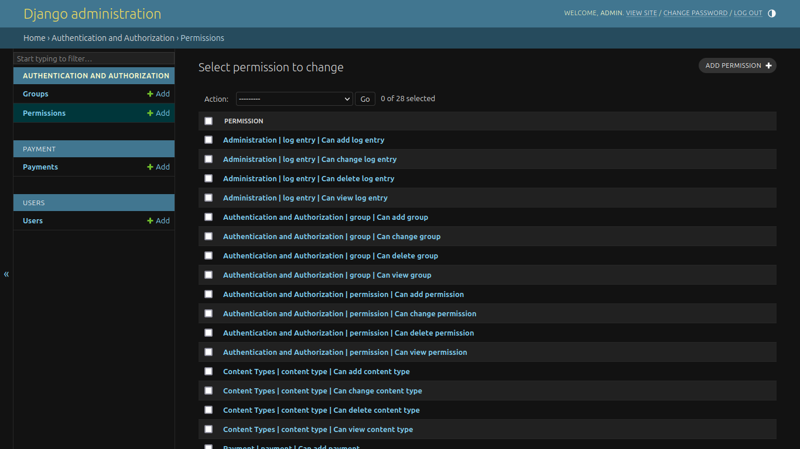

# Finance Web Application

This project is a web application developed using React for the frontend and Django for the backend. It provides features such as user authentication, blog management, about, contact, and portfolio pages with interactive graphs.

## Features

- **User Authentication:** Users can sign up for an account or log in using their email and password. Authentication is implemented using JSON Web Tokens (JWT) for secure communication between the frontend and backend. Users can also log out of their accounts.
- **Blog Management:** Authenticated users can create, read, update, and delete blog posts. Each blog post contains a title, content, author information, and publication date.
- **About Page:** The about page provides information about the project, team members, and the purpose of the application.
- **Contact Page:** Users can reach out to the team behind the project through the contact page. The contact form allows users to submit their inquiries or feedback.
- **Portfolio Pages with Graphs:** The application includes portfolio pages where users can view their financial portfolio. Interactive graphs and charts visualize the user's financial data, such as investment performance, asset allocation, and historical trends.

## Technologies Used

- **Frontend:** React.js, Material-UI
- **Backend:** Django, Django REST Framework
- **Database:** SQLlite
- **Authentication:** JSON Web Tokens (JWT)
- **Data Visualization:** Chart.js, Plotly.js
- **Deployment:** Docker, Heroku (for backend), Netlify (for frontend)

## Installation

1. Clone the repository:
   Ignore for now, it's not on github yet
   ```bash

   ```

2. Navigate to the project directory:

   ```bash
   cd FinanceReactDjango
   ```

3. Backend Setup:

   ```bash
   cd backend
   ```
   ```bash
   python -m venv venv
   ```
   Linux or MpyacOS
   ```bash
   source venv/bin/activate
   ```
   Windows
   ```bash
   venv\Scripts\activate
   ```
   ```bash
   pip install -r requirements.txt
   ```
   ```bash
   python manage.py makemigrations
   ```
   ```bash
   python manage.py migrate
   ```
   ```bash
   python manage.py createsuperuser
   ```
   ```bash
   python manage.py runserver
   ```
   Django server will start at http://localhost:8000/

4. Frontend Setup:

   Open a new terminal and navigate to the project directory:
   ```bash
   cd frontend
   ```
   ```bash
   npm install
   ```
   ```bash
   npm run dev
   ```
   React server will start at http://localhost:5173/

5. Open the application in your web browser:

   ```bash
   http://localhost:5173/
   ```
   ```bash
   http://localhost:8000/admin/
   ```

## Error Handling
- Make sure your frontend should work on port 5173 and backend on 8000, otherwise you need to make changes in backend settings.py and need to provide the new frontend url in CORS_ORIGIN_WHITELIST. If you are using different port for backend then you need to change the Auth.js baseURL in frontend.
- If you are using different database then you need to change the database settings in settings.py of backend.
- If you encounter any issues while running the application, please feel free to open an issue on this repository. We will be happy to help you troubleshoot the problem.


## Screenshots

Login Page


Home Page


About Page


Payment Page


Django Admin Page



## Authors
- Priya Bhardwaj - [@priyaa-bhardwaj](https://www.github.com/priyaa-bhardwaj)
- Aman Singh - [@amankrs21](https://www.github.com/amankrs21)


## License

This project is licensed under the MIT License. See the [LICENSE]


## Note
Note: This is a project created for educational purposes and is not intended for commercial use.


## Contributing
Pull requests are welcome. For major changes, please open an issue first to discuss what you would like to change.